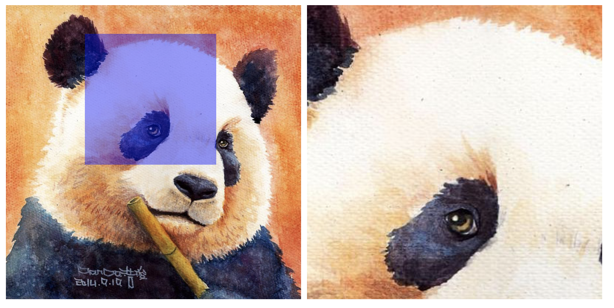

<h1 align="center">放大镜查看图片</h1>

## 介绍
`glassbig` 是一个简单展示图片放大效果的插件。

## 基本使用
#### 🛠 安装
```javascript
npm install --save glassbig
```

#### 📦 使用
首先, 从你的文件中引入插件。
```javascript
import GlassImg from 'glassbig'
```

再者，创建一个实例对象, 并传参
```javascript
const imgbox = new GlassImg({
  id: 'imgGlass',
  width: 400,
  height: 400,
  img: './pic.jpg'
});
```

也可以修改图片src～
```javascript
imgbox.changeImg('./pic2.jpg');
```
#### 💃 图片展示使用


#### 📕 参数说明
| 参数 | 描述 | 类型 | 默认值 |
| --- | --- | --- | --- |
| `id` | 需要展示放大效果的箱子 id | string | null |
| `height` |  箱子高度 | string | '400px'|
| `width` | 箱子宽度 | string | '400px' |
| `img` | 图片地址 | string | null |


